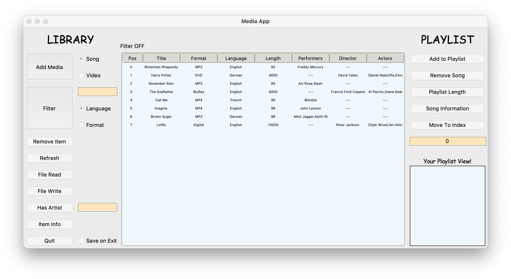

# Media App

This is a (mock) media app completed as part of an assessment using Tkinter. The purpose of this was more intended as practice working with Tkinter, rather than providing anything useful (Note that the app doesn't actually play media items!).

# Instructions

This app allows one to add songs or videos, filter in various ways, read in data from a file, write data to a file, among other things.

Looking at the left hand side of the GUI (main library controls)

1. To add a media item, select the relevant radio button (`Video` or `Song`), click the `Add Media` button then enter details into the fields. This will add the media item to the main library view (centre of the GUI).

2. To remove item, select the item from the main library view and click `Remove Item`

3. To refresh the library view, clearing any filters, click `Refresh`

4. To read in from a file, click the `File Read` button. Note that the `Media.csv` file provided is pre-filled and in the correct format

5. To write to a file (this will load all library items to csv) click the `File Write` button and give the CSV a name

6. To check if a media items contains a particular artist, enter the artists name into the text box next to `Has Artist`, select an item from the library view, and click the `Has Artist`

7. To get some information on a media item, select it from the library view and click `Item Info`

8. To quit the app, click `Quit`. Note, if you select the radio button `Save on Exit`, this will save current library contents to `init_library.csv` provided. Data here is loaded into the library view each time the app is opened.

Looking at the right hand side now (playlist controls)

1. To add a media item to the playlist, select a Song from the library view and click `Add to Playlist`. Note that Videos can't be added to the playlist. You'll see that the song has been added to the playlist view (bottom right)

2. To remove the song from the playlist, select it from the playist view and click `Remove Song`

3. To return the playlist lengh, select the `Playlist Length` button

4. To get info on the song, select the song from the playlist view and click `Song Information`

5. To rearrange songs, select the song from the playlist, enter what index you would like the song moved to (0 is the first position in the playlist) into the text box beneath the `Move to Index` button and click the button

# What I've learned from this project

Through this project, I have developed my skills with Tkinter, particularly with regard to moving widgets around.

I've further developed my knowledge surrounding event drive programming, with a much clearer idea of how this works.

I have also develooped skills with OOP, something I had avoided up until now.

# What I enjoyed

I liked finally being able to apply OOP. This was something I'd dabbled in, but never really utilised within a project. I also found designing the applications to be exciting. I'll admit that I found moving Tkinter widgets around to be frustrating, but finally getting it to look the way I wanted it to was rewarding. In future however, I may just stick to something like Visual Studio if developing an app.

# Future changes

* Instead of storing data in CSVs, I would store it in a database
* I may rework the app to accept real media items
